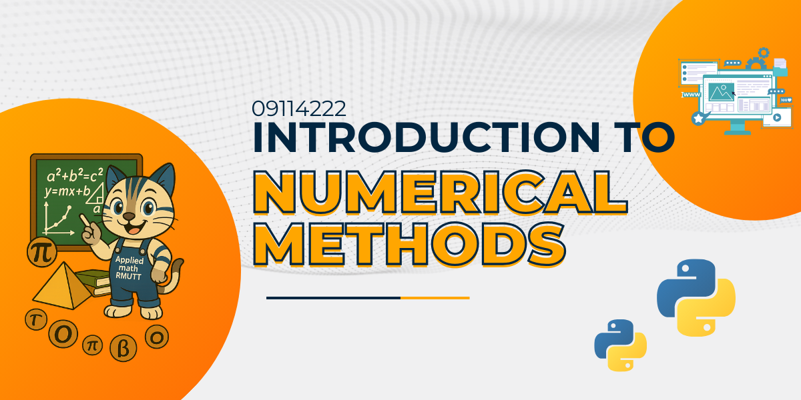

# Numerical Methods for Computers
Offical Repository of RMUTT 09131201 Numerical Methods for Computers

Lecturer: Wongwisarut Kuangsatung, Ph.D., Assoc. Prof. Dr.




## Schedules

SEMESTER 1/2568

| Section | Date    | Lecture  | Workshop | MS-Team Code | [D-Learn](https://dlearn.rmutt.ac.th/course/view.php?id=2318) Key |
|---------|---------|----------|----------|--------|---------|
|  SEC01  | THU     |ST1905 เวลา 13.00 - 15.00 | ST1905 เวลา 15.00 - 17.00 | `2vk9i4v` | `sop-ETY-CS1`  |
|  SEC02  | THU     |ST1905 เวลา 08.00 - 10.00 | ST1905 เวลา 10.00 - 12.00  | `3skdopw` | `pvf-NTD-CS2`  |
|  SEC03  | TUE     |ST1905 เวลา 13.00 - 15.00 | ST1905 เวลา 15.00 - 17.00 | `h2t52ic` | `eru-TVD-CS3`  |


## Examinations

| Section | MIDTERM | FINAL  | Location|
|---------|---------|-------|---------|
| SEC 01-03 | 2 กันยายน 2568 เวลา 09.00 - 12.00  | 28 ตุลาคม 2568 เวลา 09.00 - 12.00  | ST5-703/ST5-704 |


## Course Description

การวิเคราะห์ความคลาดเคลื่อน การหาผลเฉลยของสมการไม่เชิงเส้นโดยวิธีแบ่งครึ่งช่วง วิธีวางผิดที่ วิธีทำซ้ำ วิธีนิวตัน วิธีซีแคนต์ และอื่น ๆ ผลเฉลยของระบบสมการเชิงเส้น การประมาณค่าในช่วง การประมาณค่าแบบกำลังสองน้อยสุด การหาอนุพันธ์เชิงตัวเลข การหาปริพันธ์เชิงตัวเลข การพัฒนาแอพพลิเคชั่นในการแก้ปัญหาด้วยระเบียบวิธีเชิงตัวเลขเบื้องต้น และปฏิบัติการที่เกี่ยวข้อง

Error analysis, solutions of nonlinear equations with bisection method, regular false method, iterative method, Newton method, secant method, solutions of linear equations, interpolations, least square approximations, numerical differentiations, numerical integrations, elementary application development for solving problems with numerical methods and related laboratory

## Class Materials

|    Topic   |   Description   |    Material/Workshop   |
|------------|-----------------|---------------|
| [Erorrs and Approximation](./materials/CH1.pdf) | ค่าคลาดเคลื่อนและค่าประมาณ | [Handout](./materials/CH1.pdf) <br> [Workshop 01](./materials/workshop_01.ipynb) |
| [Root Finding](./materials/CH2.pdf) | รากของสมการ | [Handout](./materials/CH2.pdf) <br> [Workshop 02](./materials/workshop_02.ipynb) <br>  [Workshop 03](./materials/workshop_03.ipynb)|
| [Systems of Linear Equations](./materials/CH3.pdf) | ระบบสมการเชิงเส้น | [Handout](./materials/CH3.pdf) <br> [Workshop 04](./materials/workshop_04.ipynb) <br> [Workshop 05](./materials/workshop_05.ipynb) <br> [Workshop 06](./materials/workshop_06.ipynb) <br> [Workshop 07](./materials/workshop_07.ipynb)|
| [Regression](./materials/CH4.pdf) | สมการถดถอย | [Handout](./materials/CH4.pdf) <br> [Workshop 08](./materials/workshop_08.zip) <br> [Workshop 09](./materials/workshop_09.zip) |
| [Interpolation](./materials/CH5.pdf) | การประมาณค่าในช่วง | [Handout](./materials/CH5.pdf) <br> [Workshop 10](./materials/workshop_10.ipynb) <br> [Workshop 11](./materials/workshop_11.zip) |
| [Numerical Differentiation and  Integration](./materials/CH6.pdf) | อนุพันธ์และปริพันธ์เชิงตัวเลข | [Handout](./materials/CH6.pdf) <br> [Workshop 12](./materials/workshop_12.ipynb) |


## Grades

คะแนนเต็ม 100 คะแนน โดยแบ่งออกเป็น
- การสอบกลางภาค 25%
- การสอบปลายภาค 25%
- การสอบย่อย 25%
- งานที่ได้รับมอบหมาย 25%

หากนักศึกษาเข้าเรียนน้อยกว่า 80% ของเวลาเรียนทั้งหมด
หรือได้คะแนนรวมน้อยกว่า 50% ของคะแนนเต็ม นักศึกษาจะไม่ผ่านในรายวิชานี้ และได้รับการบันทึกผลการเรียน F (เกรด 0.0) 

สำหรับนักศึกษาที่ผ่านเกณฑ์ดังกล่าว จะได้รับการบันทึกผลการเรียนตามเกณฑ์ของคะแนน t-score 

```
t-score = 50 + 10*(x - u)/s
```
เมื่อ x คือคะแนนรวม, u คือคะแนนเฉลี่ยของคะแนนรวม และ s คือส่วนเบี่ยงเบนมาตรฐานของคะแนนรวม

ดังนี้

| ผลการเรียน | เกรด | เกณฑ์ t-score |
|---------|------|--------------|
| F | 0.00 | (-Inf, 50) | 
| D | 1.00 | [50, 55) | 
| D+ | 1.50 | [55, 60) | 
| C | 2.00 | [60, 65) |
| C+ | 2.50 | [65, 70) |
| B | 3.00 | [70, 75) |
| B+ | 3.50 | [75, 80) |
| A | 4.00 | [80, Inf) |

## References

- Steven C. Chapra and Raymond P. Canale, (2015) Numerical Methods for Engineers 7th edition, McGraw-Hill Education, 2Penn Plaza, New York.
- Burden, R. L., & Faires, J. D. (2005). Numerical Analysis (8th ed.). Belmont, CA: Thompson Brooks/Cole.
- ปราโมทย์ เดชะอำไพ และนิพนธ์ วรรณโสภาคย์, (2010) ระเบียบวิธีเชิงตัวเลขในงานวิศวกรรม, สำนักพิมพ์จุฬาลงกรณ์มหาวิทยาลัย
- วรสิทธิ์ กาญจนกิจเกษม, (2014) ระเบียบวิธีเชิงตัวเลข, สำนักพิมพ์จุฬาลงกรณ์มหาวิทยาลัย
